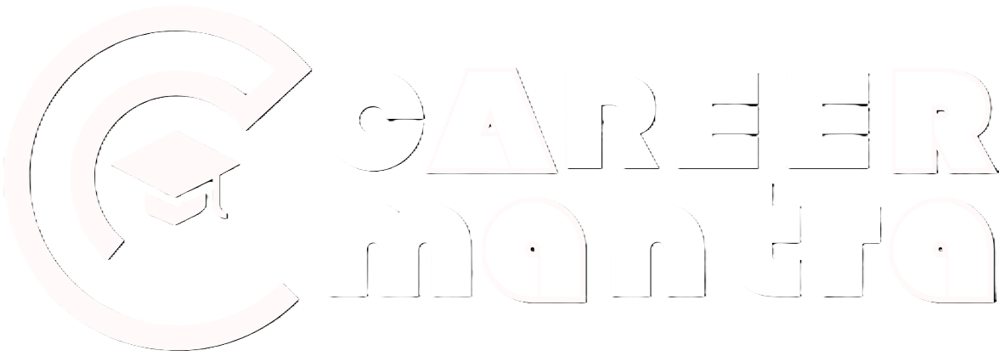

<!--  -->
<div align="center">

</div>

## CollegeHike is a Platform that offers UG & PG admission in various prestigious universities.

## Live at - https://collegehike.vercel.app/ 🚀

## Run Locally

Clone the project

```bash
  git clone "https://https://github.com/Dev7083/CollegeHike.git"
```

Go to the project directory

```bash
  cd CollegHike
```

Install dependencies

```bash
npm install
```

Start the server

```bash
npm run dev
```

## Tech Stack

**Client:** TypeScript, React, Next.js

**Server:** Node, Express

---

```
CollegeHike - Project Tree
├─ .eslintrc.json
├─ .gitattributes
├─ .gitignore
├─ components.json
├─ jsconfig.json
├─ next.config.mjs
├─ package-lock.json
├─ package.json
├─ postcss.config.mjs
├─ public
├─ README.md
├─ server
│  └─ index.js
├─ src
│  ├─ app
│  │  ├─ career
│  │  │  ├─ career-navigation
│  │  │  │  └─ index.jsx
│  │  │  ├─ courses
│  │  │  │  ├─ course-card
│  │  │  │  │  └─ index.jsx
│  │  │  │  ├─ courseData.js
│  │  │  │  └─ index.jsx
│  │  │  ├─ interview
│  │  │  │  ├─ index.jsx
│  │  │  │  ├─ interview-qa-data.js
│  │  │  │  └─ qa-accordion
│  │  │  │     └─ index.jsx
│  │  │  ├─ job-portal
│  │  │  │  └─ index.jsx
│  │  │  ├─ live-interview
│  │  │  │  ├─ index.jsx
│  │  │  │  └─ video-chat
│  │  │  │     └─ index.jsx
│  │  │  ├─ moral-support
│  │  │  │  └─ index.jsx
│  │  │  ├─ page.jsx
│  │  │  ├─ resume
│  │  │  │  ├─ basic-detail
│  │  │  │  │  └─ index.jsx
│  │  │  │  ├─ education-detail
│  │  │  │  │  └─ index.jsx
│  │  │  │  ├─ index.jsx
│  │  │  │  ├─ professional-detail
│  │  │  │  │  └─ index.jsx
│  │  │  │  └─ resume-template
│  │  │  │     └─ index.jsx
│  │  │  └─ roadmap
│  │  │     ├─ index.jsx
│  │  │     └─ roadmapData.js
│  │  ├─ code-editor
│  │  │  ├─ api.js
│  │  │  ├─ editor
│  │  │  │  ├─ editor-output
│  │  │  │  │  └─ index.jsx
│  │  │  │  ├─ index.jsx
│  │  │  │  └─ language-selector
│  │  │  │     └─ index.jsx
│  │  │  ├─ EditorData.js
│  │  │  └─ page.jsx
│  │  ├─ components
│  │  │  ├─ buttons
│  │  │  │  ├─ dot-button
│  │  │  │  │  └─ index.jsx
│  │  │  │  ├─ dot-button-dark
│  │  │  │  │  └─ index.jsx
│  │  │  │  └─ primary
│  │  │  │     ├─ index.jsx
│  │  │  │     └─ primary-dark
│  │  │  │        └─ index.jsx
│  │  │  ├─ category-selector
│  │  │  │  └─ index.jsx
│  │  │  ├─ container
│  │  │  │  └─ index.jsx
│  │  │  ├─ footer
│  │  │  │  └─ index.jsx
│  │  │  ├─ gradient
│  │  │  │  └─ index.jsx
│  │  │  └─ header
│  │  │     ├─ anim.js
│  │  │     ├─ index.jsx
│  │  │     ├─ nav
│  │  │     │  ├─ Curve
│  │  │     │  │  └─ index.jsx
│  │  │     │  ├─ Footer
│  │  │     │  │  └─ index.jsx
│  │  │     │  ├─ index.jsx
│  │  │     │  └─ Link
│  │  │     │     └─ index.jsx
│  │  │     └─ style.module.scss
│  │  ├─ fonts
│  │  ├─ founders
│  │  │  ├─ about-founders
│  │  │  │  ├─ index.jsx
│  │  │  │  ├─ modal
│  │  │  │  │  └─ index.jsx
│  │  │  │  └─ projects
│  │  │  │     └─ index.jsx
│  │  │  ├─ image-parallax
│  │  │  │  ├─ index.jsx
│  │  │  │  └─ styles.module.scss
│  │  │  └─ page.jsx
│  │  ├─ globals.css
│  │  ├─ home
│  │  │  ├─ about
│  │  │  │  ├─ index.jsx
│  │  │  │  └─ socials
│  │  │  │     └─ index.jsx
│  │  │  ├─ faq
│  │  │  │  ├─ index.jsx
│  │  │  │  └─ universitymarquee
│  │  │  │     └─ index.jsx
│  │  │  ├─ hero
│  │  │  │  ├─ hero-slider
│  │  │  │  │  └─ index.jsx
│  │  │  │  ├─ index.jsx
│  │  │  │  ├─ rings
│  │  │  │  │  └─ index.jsx
│  │  │  │  └─ scroll-down
│  │  │  │     └─ index.jsx
│  │  │  ├─ index.jsx
│  │  │  ├─ opportunity
│  │  │  │  └─ index.jsx
│  │  │  └─ our-app
│  │  │     └─ index.jsx
│  │  ├─ layout.js
│  │  ├─ lounge
│  │  │  └─ page.jsx
│  │  ├─ page.js
│  │  ├─ resource
│  │  │  ├─ page.jsx
│  │  │  ├─ resource-card
│  │  │  │  └─ index.jsx
│  │  │  ├─ resource-container
│  │  │  │  └─ index.jsx
│  │  │  └─ resourceData.js
│  │  ├─ sign-in
│  │  │  └─ [[...sign-in]]
│  │  │     └─ page.jsx
│  │  ├─ sign-up
│  │  │  └─ [[...sign-up]]
│  │  │     └─ page.jsx
│  │  └─ template.jsx
│  ├─ components
│  │  └─ ui
│  │     ├─ accordion.jsx
│  │     └─ card.jsx
│  ├─ lib
│  │  └─ utils.js
│  └─ middleware.ts
└─ tailwind.config.js

```
